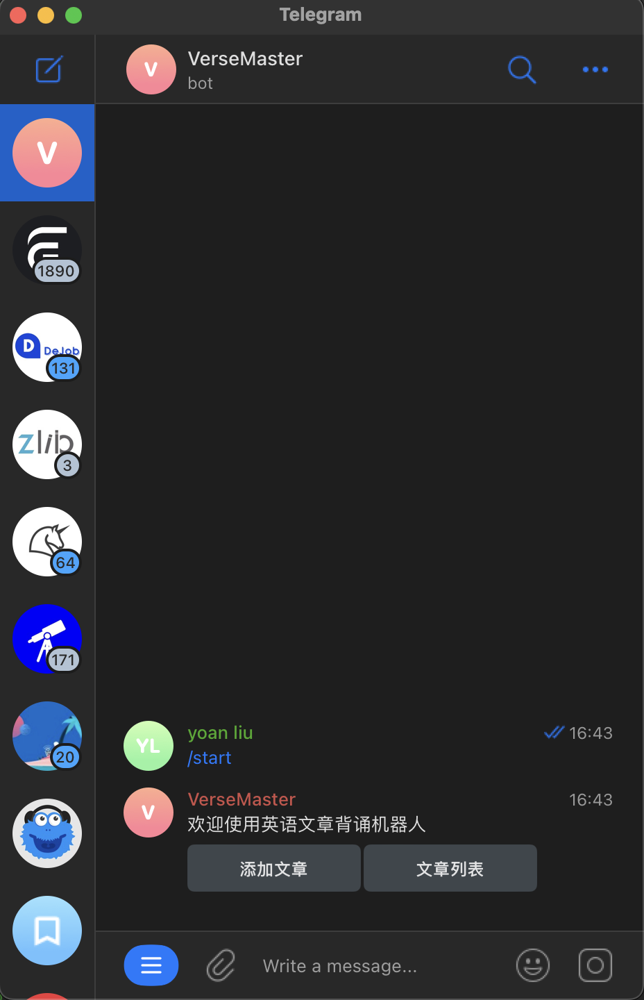
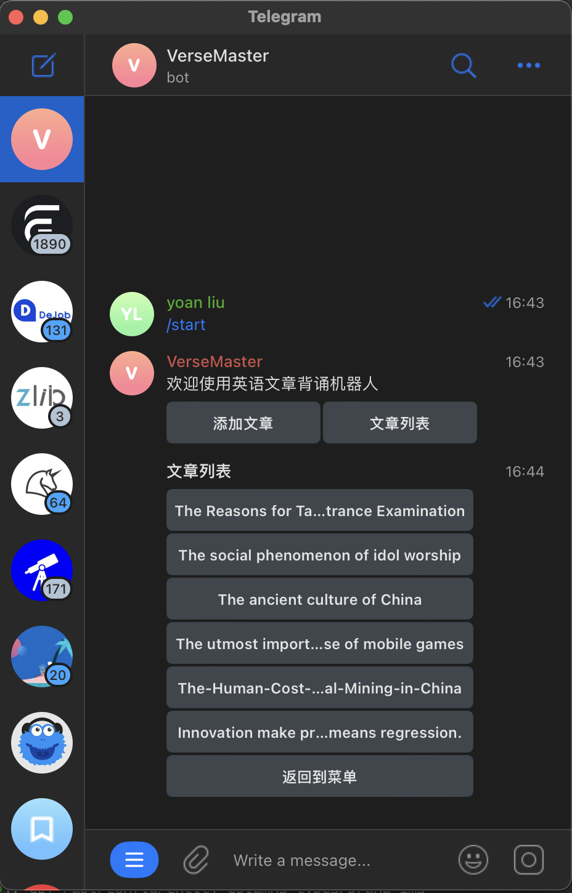
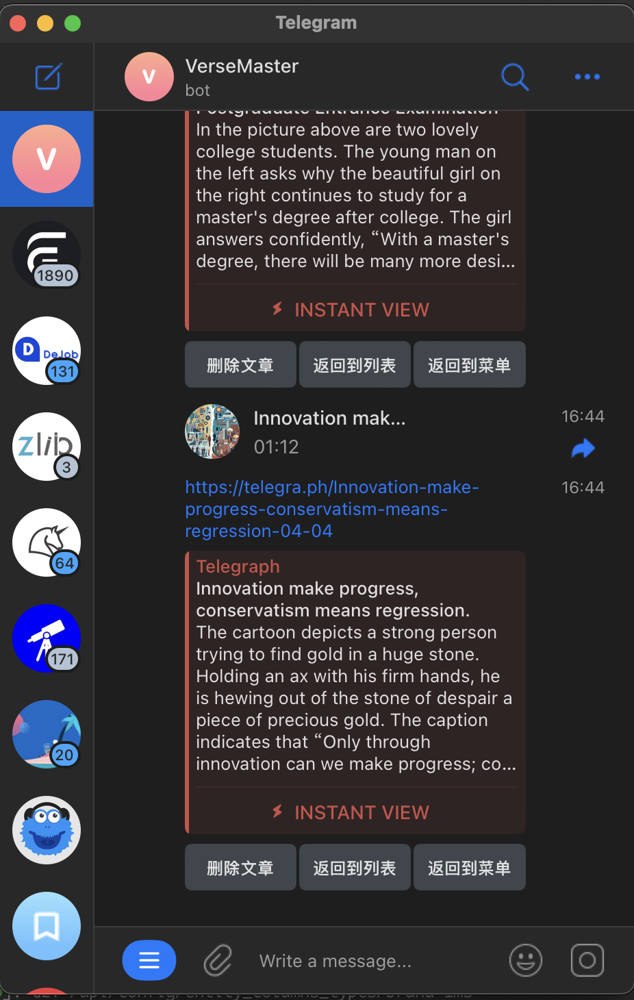

# ikit-tg

基于 telegram bot 的英语学习机器人。

## 介绍

不需要思考，提到英语学习，首先想到的就是背单词。但是背单词有以下缺点：

1. 背的单词太零碎就像一个个孤岛，无法联系起来，今天背的单词就算明天不忘，过一个月也差不多该忘了。
2. 背单词锻炼的能力太过单一，甚至不能说是锻炼能力，而是锻炼机械的记忆力。听、说、读、写没有一个能得到练习。
3. 太慢了，语言学习的目标是听得懂、说的出来并能写出来，背单词应该是语言学习过程顺便的事情。

我在英语学习的过程中发现背短文是个不错的方法，背短文有以下几个好处：

1. 首先要弄懂每个单词的读音、意思，不然没法背。
2. 要理解每个句子的意思，这就要分析句子的结构，用了哪些语法。有时候会发现单词都认识，但是拼成的句子就看不懂，主要就是对语法不熟悉。
3. 我的背诵形式主要是默写，中间如果有嗑巴的地方，我自己会分析后面应该是什么词性，应该接什么内容，后续对照原文查漏补缺，在这个过程中语法的理解会得到锻炼，同时写作能力也会提到提高。

但是这个过程中听力并没有得到锻炼，我们找的语料可能也没有语音。ikit-tg 就是用于解决这个问题的项目。

## 功能

- 添加文章，并将文章转换成语音。
- 历史文章管理，可以听、查看添加过的文章，也可以将不再需要的文章删除。

## 使用方法

1. 下载项目，并编译

```
git clone git@github.com:usual2970/ikitTG.git

cd ikitTG

go build -o ikit-tg
```

2. 设置环境变量

```shell
# telegram 机器人token
export TG_TOKEN=<telegram bot token>
# 智谱ai api key 用于生成文章的thumbnail
export ZHIPU_API_KEY=<zhipu api key>
# azure 语音api key 用于将文章转换成语音
export AZURE_SPEECH_KEY=<azure speech key>
```

3. 运行 ikit-tg

```
./ikit-tg serve
```

## 运行效果

### 菜单



### 文章列表



### 文章详情




## 许可证

MetaForge 遵循 [MIT License](https://github.com/usual2970/ikitTG/blob/main/LICENSE)，这意味着你可以自由地使用、复制、修改和分发本软件。

---

开始构建你的高效管理后台之旅吧！如有任何问题或建议，欢迎提交 Issue 或 Pull Request。让我们一起让 MetaForge 变得更加出色！
